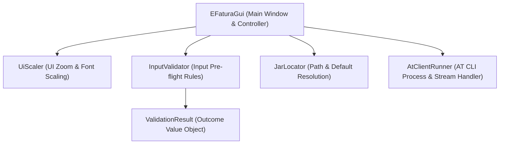

# Architecture & Code Design Document

This document describes the architectural layout and logical components of the `gui-wrapper` Java Swing application.

## Overview

The application is a Swing GUI wrapper around the official AT command-line client (`FACTEMICLI-*.jar`). It isolates UI layout, input validation, environment path resolution, dynamic UI scaling, and process execution management into modular components.

---

## Component Breakdown

### 1. `EFaturaGui` ([src/EFaturaGui.java](src/EFaturaGui.java))
* **Role:** Main Application Window & Event Orchestrator (`JFrame`).
* **Responsibilities:**
  * Constructs and manages Swing layout components (header, form inputs, control buttons, split scroll pane with log area).
  * Coordinates application initialization by querying `JarLocator` for default values.
  * Triggers input validation via `InputValidator` before execution.
  * Launches `AtClientRunner` inside a `SwingWorker` thread to keep the Swing Event Dispatch Thread (EDT) responsive during process execution.
  * Dispatches log messages and updates UI state upon process termination or self-update callbacks.

### 2. `AtClientRunner` ([src/AtClientRunner.java](src/AtClientRunner.java))
* **Role:** Process Manager & Output Stream Handler.
* **Responsibilities:**
  * Builds the AT client command array using `ProcessBuilder`.
  * Masks sensitive arguments (e.g. replacing `-p <password>` with `********`) for displayed log previews.
  * Spawns background worker threads to read `stdout` and `stderr` using the native system console charset (`resolveNativeCharset()`).
  * Detects interactive AT client self-update prompts (`nova versão ...`) and automatically responds on standard input (`stdin`) with the target download directory.
  * Provides non-blocking process termination (`stopProcess()`).

### 3. `InputValidator` ([src/InputValidator.java](src/InputValidator.java))
* **Role:** Form Validation Rules.
* **Responsibilities:**
  * Validates user inputs prior to process launch.
  * Checks for mandatory fields (NIF, password).
  * Validates numeric formats and value ranges (4-digit YYYY year, 01–12 MM month).
  * Verifies existence of specified JAR and SAF-T XML files on disk.

### 4. `ValidationResult` ([src/ValidationResult.java](src/ValidationResult.java))
* **Role:** Simple Value Object.
* **Responsibilities:**
  * Immutable container representing validation status (`ok` boolean and human-readable `message`).

### 5. `JarLocator` ([src/JarLocator.java](src/JarLocator.java))
* **Role:** File & Path Resolution Strategy.
* **Responsibilities:**
  * Auto-detects the AT client JAR file matching the `FACTEMICLI` prefix across the application directory, parent folder, and current working directory.
  * Discovers default sample SAF-T XML files in the environment.
  * Generates default year and month strings based on current system date.

### 6. `UiScaler` ([src/UiScaler.java](src/UiScaler.java))
* **Role:** Dynamic UI Zoom & Font Manager.
* **Responsibilities:**
  * Recursively traverses component trees to adjust component dimensions and font sizes according to selected scale ratios (95%, 100%, 110%).
  * Caches initial font instances in component client properties (`baseFont`) to prevent font metric degradation during repeated scaling changes.

---

## Execution Flow

1. **Startup:** `EFaturaGui` initializes components, queries `JarLocator` to populate form defaults, and applies default `UiScaler` scale.
2. **User Interaction:** User modifies fields and clicks **Executar**.
3. **Validation:** `InputValidator.validate(...)` is called. If validation fails, a modal warning is displayed.
4. **Execution:**
   - `AtClientRunner.buildCommand(...)` prepares command arguments.
   - `SwingWorker` starts `AtClientRunner.runProcess(...)`.
   - Live process logs are streamed to `logArea`.
   - If an AT self-update prompt is detected, `AtClientRunner` answers `stdin` and updates `jarPathField` with the new target path.
5. **Completion / Termination:** Process finishes or user clicks **Parar**, updating UI button states.
